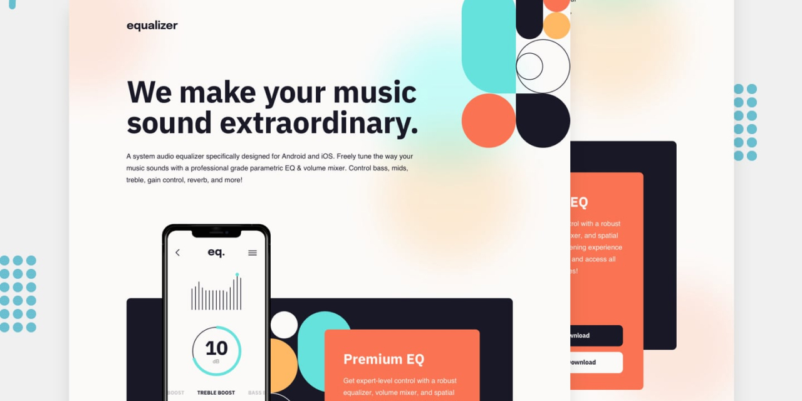

# Frontend Mentor - Equalizer landing page solution

This is a solution to the [Equalizer landing page challenge on Frontend Mentor](https://www.frontendmentor.io/challenges/equalizer-landing-page-7VJ4gp3DE).
Frontend Mentor challenges help you improve your coding skills by building realistic projects.

## Table of contents

- [Overview](#overview)
  - [The Challenge](#the-challenge)
  - [Screenshot](#screenshot)
  - [Links](#links)
    - [My Process](#my-process)
      - [Build with](#built-with)
      - [What I learned](#what-i-learned)
      - [Continued Development](#continued-development)
      - [Useful Resources](#useful-resources)
- [Author](#author)
- [Acknowledgments](#acknowledgments)

## Overview

### The Challenge

Users should be able to:

- View the optimal layout depending on their device's screen size
- See hover states for interactive elements

### Screenshot



### Links

- Solution URL: [Solution]()
- Live Site URL: [Live](https://grifano.github.io/Equalizer-landing-page/)

## My process

### Built with

Semantic HTML5 markup

- CSS custom properties
- SASS/SCSS
- Position
- Responsive Web Design

### What I learned

how to change background-color for SVG icon through CSS, using fill property.

```css
...
  svg path {
    transition: all 0.3s ease 0s;
  }
  &:hover {
    svg path {
      fill: $coral !important;
    }
  }
...
```

how to apply a couple of background images to one element, and to set a value for each image.

```css
...
  background-image: url("../assets/bg-pattern-1.svg"),
    url("../assets/bg-main-desktop.png");
  background-repeat: no-repeat no-repeat;
  background-size: 28vmin, auto;
  background-position: top right, 70% 20%;
...
```

### Continued development

I'm focusing on improving my programming skills with HTML&CSS and JavaScript. My plan is to get comfortable with the basics before I going to dive into the Frontend framework/library like React, Angular, Vue, etc.
I hope that such amzing tools like [Frontend Mentor](https://www.frontendmentor.io/) and [Uxcel](https://uxcel.com?invite=EE4PBID94EEH) help me with my this.

### Useful resources

[StackOverflow](https://stackoverflow.com/questions/39743161/svg-fill-color-not-working) - How to change color for SVG element through CSS.
[MDM Web Doc](https://developer.mozilla.org/en-US/docs/Web/CSS/background-position-y) - This is halp me with positioning background elements.  
[PX to VW](https://web-development.space/tools/px-to-vw/) - A helpful tool for converting px to vw depending on viewport.
[Frontend Mentor](https://www.frontendmentor.io/) - Get a challenge and try to make them as close to a mockup as you can.  
[Uxcel](https://uxcel.com?invite=EE4PBID94EEH) - improv UX/UI Design skills, by reading the article and check your new knowledge by passing a quiz.

## Author

- Website - [Serhii "Gr[i]fano" Orlenko"](https://grifano.webflow.io/)
- Frontend Mentor - [@Grifano](https://www.frontendmentor.io/profile/Grifano)
- Twitter - [@Grifano](https://twitter.com/OrlenkoSerhii)
- LinkedIn - [@Grifano](https://www.linkedin.com/in/serhii-orlenko-44aaa4a3/)

<!-- ## Acknowledgments -->
